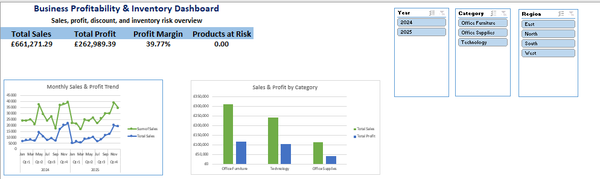

# Business Profitability & Inventory Analysis

## Project Overview

This project is an Excel-based business analytics case study for a fictional office supplies company called **Northstar Office Supplies**.

The goal of the project is to analyze sales performance, profitability, discount impact, and inventory risk using a complete Excel workflow.

The final workbook includes Power Query transformations, PivotTables, PivotCharts, KPI cards, slicers, dashboard visuals, business insights, and recommendations.

---

## Business Problem

Northstar Office Supplies needs to understand which products, categories, and regions are driving profitability, and whether current discounting and inventory decisions are supporting business performance.

This project answers the following business questions:

- Which categories generate the highest sales and profit?
- Which region performs best?
- Which products contribute the most to profitability?
- How do discounts affect profit?
- Which products require inventory monitoring?
- What business actions should management take?

---

## Tools Used

- Microsoft Excel
- Power Query
- PivotTables
- PivotCharts
- Slicers
- Excel formulas
- Dashboard design
- Business analysis

---

## Dataset

The dataset is simulated for portfolio and learning purposes. It represents sales transactions, product details, and inventory information for an office supplies business.

The project includes:

- orders.csv: sales transaction data
- products.csv: product details, categories, costs, and suppliers
- inventory_snapshot.csv: current inventory status
- data_dictionary.csv: explanation of dataset columns
- Project_02_Working_File.xlsx: final Excel workbook with analysis and dashboard

---

## Project Structure

business-profitability-inventory-analysis/

README.md  
Project_02_Working_File.xlsx  
data_dictionary.csv  

data/raw/  
orders.csv  
products.csv  
inventory_snapshot.csv  

---

## Data Preparation Process

The raw CSV files were imported into Excel using Power Query.

Main preparation steps:

1. Imported orders, products, and inventory data.
2. Set correct data types for dates, text, and numeric fields.
3. Merged sales data with product details using Product_ID.
4. Created calculated fields for cost, profit, and profit margin.
5. Created Order_Month and Order_Year fields for time analysis.
6. Created Discount_Band to evaluate discount behavior.
7. Merged inventory data with product information.
8. Created Inventory_Value and Stock_Coverage_Ratio.
9. Classified inventory risk into Healthy, Watch, and Reorder Required.
10. Loaded cleaned tables into Excel for PivotTable and dashboard analysis.

---

## Calculated Metrics

Total_Cost = Quantity × Unit_Cost

Profit = Sales - Total_Cost - Shipping_Cost

Profit_Margin = Profit / Sales

Inventory_Value = Stock_On_Hand × Unit_Cost

Stock_Coverage_Ratio = (Stock_On_Hand + Units_On_Order) / Reorder_Point

---

## Dashboard Features

The Excel dashboard includes:

- Total Sales KPI
- Total Profit KPI
- Profit Margin KPI
- Products at Risk KPI
- Monthly Sales & Profit Trend
- Sales & Profit by Category
- Sales & Profit by Region
- Top Products by Sales & Profit
- Discount Impact Analysis
- Inventory Risk Summary
- Interactive slicers for Year, Region, and Category

---

## Key Insights

- Office Furniture was the top-performing category, generating £115,688 in profit and £309,409 in sales.
- The West region generated the highest regional profit of £75,539, with total sales of £185,482.
- Nexa Standing Desk was the most profitable product, generating £48,700 in profit and £130,114 in sales.
- Orders with no discount generated the highest sales and profit.
- High-discount orders generated the lowest profit, indicating that heavy discounting reduced profitability.
- Inventory analysis showed that 11 out of 15 products were in a healthy position, while 4 products required monitoring under the Watch category.
- No products required immediate reordering at the time of analysis.

---

## Business Recommendations

1. Optimize the discount strategy by limiting high-discount campaigns and focusing on no-discount or low-discount offers.
2. Prioritize Office Furniture in sales planning and resource allocation because it generated the highest category profit.
3. Increase focus on Nexa Standing Desk through targeted promotions, inventory prioritization, and cross-selling opportunities.
4. Monitor the 4 products in the Watch inventory category to prevent future stock shortages.
5. Use the strong performance of the West region as a benchmark to improve lower-performing regions.

---

## Skills Demonstrated

This project demonstrates the following data analyst skills:

- Data cleaning and transformation using Power Query
- Data modeling through table merging
- Calculated metrics creation
- Profitability analysis
- Inventory risk analysis
- PivotTable analysis
- PivotChart visualization
- Dashboard design
- KPI reporting
- Interactive slicer setup
- Business insight writing
- Recommendation development
- Portfolio-ready documentation

---

## Final Deliverable

The main deliverable is the Excel workbook:

Project_02_Working_File.xlsx

The workbook contains cleaned data, analysis tables, PivotTables, an interactive dashboard, and business insights.

---

## Note

This project uses simulated business data created for portfolio demonstration purposes. The workflow, metrics, and dashboard design are structured to reflect a realistic business analytics scenario.
